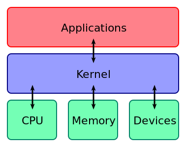

# What is Linux?

```

Brief (to be removed)

(kernel vs operating system)
linux and unix
Linux distros (Ubuntu, Debian, Fedora etc.)

```

The word ‘Linux’ is actually used to describe two separate things: a family of open-source operating systems, and what is called the **kernel** that underlies those operating systems. The kernel is the core part of an operating system, and provides the interface between software and a computer’s hardware. In this guide we’ll just refer to the family of operating systems.

A Linux operating system includes the Linux kernel, plus a package management system and extra libraries provided by GNU. For that reason, the Linux operating system is sometimes referred to as ‘GNU/Linux’ to distinguish it from the Linux kernel.


###### Applications and other software access the computer hardware through the kernel

The Linux family is a subset of a larger family called Unix, which encompasses other operating systems such as macOS, BSD and Solaris. Windows is not part of the Unix family.

## What is a distro?

Each operating system within the Linux family is called a ‘distribution’, or **‘distro’** for short. Each distro controls its own graphical user interface and package management system, whilst still using the Linux kernel and several other GNU libraries. Over 300 flavours of Linux now exist, so picking a single one to use can be hard! Some popular distros include Ubuntu (installed on lab machines), Debian, Fedora, and Linux Mint.
