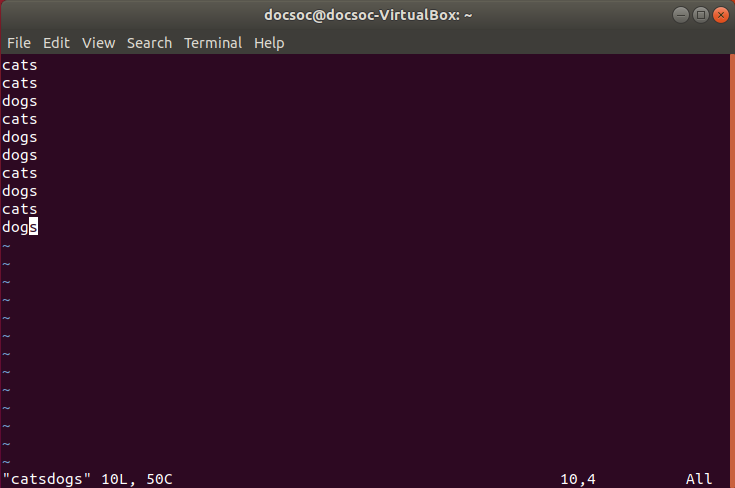

# More commands

```
Brief (to be removed)

touch
cat
mkdir
rm (-rf)
cp (-R)
mv
sudo (+ which directories you need to sudo to write to)
grep (-n) (alternatives: ag)
chmod and permission numbers
ssh (and how to ssh into labs)
man [...]
```

You've already learnt about `ls` and `cd`. Now, we'll teach you some more useful (nay, essential) Linux commands.

Don't worry if the following list of commands seems very long at first. After lots of experience with using the Linux terminal you'll gradually start to memorise how each one works.

Remember, whenever a command needs a file/directory path you can give it as either an absolute path or relative to your working directory.

## `touch`

This is a really easy command. `touch <file>` simply creates an empty file at the specificed location! Here it is demonstrated:


###### Note that files don't have to end with an extension like `.txt`. They can be called whatever you want! Files only have extensions so that programs know what to do with that type of file.

## `cat`

`cat <file>` prints the contents of that file to your screen. In the following example we've already created a file called `hello.txt` in our home folder, which contains the text `hello world`.


```
Whenever something is printed to the screen it belongs to what is called a 'stream'. There are two output streams, called stdout and stderr, and one input stream called stdin. This is quite an advanced topic but for more information, see the Streams section.
```

## `mkdir`

`mkdir <directory>` creates an empty directory at the specified path.


###### Notice that files appear in white but directories appear in blue! The terminal colours may vary depending on what flavour of Linux you are running.

## `rm`

`rm <file>` removes that file **permanently** from your computer. Terminal commands don't use the Recycle Bin! Be very careful when using `rm` to remove files. In the example below  we use `touch` to create an empty file and `rm` to remove it.


There's one catch: if you try to use `rm` on a directory, an error is printed! To remove a directory (**and everything inside it**) we must add the `-r` and `-f` flags.

* `-r` tells the computer to remove the directory recursively (i.e. to remove all subdirectories, subsubdirectories, etc.)
* `-f` tells the computer to erase all files/directories without asking for confirmation, no matter what the file permissions are

We can stick these flags together into one string, so typing `rm -rf <directory>` will remove that directory from the computer. **Remember this is a permanent action.** In the example below we create a directory with `mkdir` and remove it with `rm -rf`.


###### `rm` on its own doesn't work, but `rm -rf` does.

## `cp`

`cp <file> <directory>` copies the file into the specified directory. The original is left intact. Here it is in action:


Similarly to `rm`, `cp` doesn't immediately work on copying directories. We must add the `-R` flag (R = recursive) to copy entire directories. Therefore `cp -R <directory1> <directory2>` copies the whole of `directory1` into `directory2`.


## `mv`

`mv <file/directory> <directory>` moves the file/directory given by the first argument into the directory given by the second argument. Unlike `cp`, `mv` doesn't need a special flag for dealing with directories; it can handle them in the same way it handles files.

## `sudo`

`sudo` is probably one of the most important commands in the Linux terminal, however we need to give you some background information before explaining what it does.

All Linux computers have a secret user called `root`, which is allowed to read, write and execute every single file on the computer. However, there are many critical system files littered around which could cause serious damage if modified accidentally. Therefore, your personal user (and all other normal users) are only allowed to read and write to certain directories on the computer, and if you try to modify a sensitive directory (like the directories in `/`) you're presented with an error.

The way around this is to prepend the word `sudo` to your command. This executes the command as the `root` user, allowing you to do pretty much whatever you want, and Terminal will ask for your password before executing the command. However you **MUST** make sure what you're doing is safe, otherwise you risk permanently breaking your Linux system. Be warned!

In the following example, we write an empty file to the root directory.


###### In the terminal, whenever you are asked to input your password, the characters you type aren't printed to the screen (although they are registered by the computer). That's why the bit after `[sudo] password for docsoc:` appears blank, even though we did actually enter our password.

## `ssh` (and how to connect to lab computers)

`ssh` is a very useful Linux tool, since it allows you to access any other public Linux computer in the world. The only prerequisites are you need to know the IP address (or DNS hostname) of the computer, and also the username and password for an account on that computer. The format for the `ssh` command is `ssh <username>@<computer>`, where `<computer>` can be either the hostname or the IP address of that computer. After executing this command, you will be prompted for the user's password before being able to remotely access the computer's terminal.

The Department of Computing provides a way for you to `ssh` into your personal account on the Huxley lab computers. There are 5 Linux servers which can be accessed via `ssh`, named as follows:

* `shell1.doc.ic.ac.uk`
* `shell2.doc.ic.ac.uk`
* `shell3.doc.ic.ac.uk`
* `shell4.doc.ic.ac.uk`
* `shell5.doc.ic.ac.uk`

Logging in to any one of them with your Imperial College credentials will allow you to access your personal account. (When the terminal asks `Are you sure you want to continue connecting?`, answer `yes`.)


After you enter your password a very long introductory message is printed, after which you can access your personal account from the terminal!

## `grep`

`grep` allows you to search for phrases within files. `grep -n "string" <file>` will print out every instance where "string" occurs in `file` (the `-n` flag makes grep print the line number at each instance of "string").

For example, say we have a file called `catsdogs` which contains the string "cats" on some lines and "dogs" on others.



Running `grep -n "cats" catsdogs` will print every instance of "cats" in `catsdogs`, along with the line number. The same can be done for "dogs".


## `chmod`

## `man`
