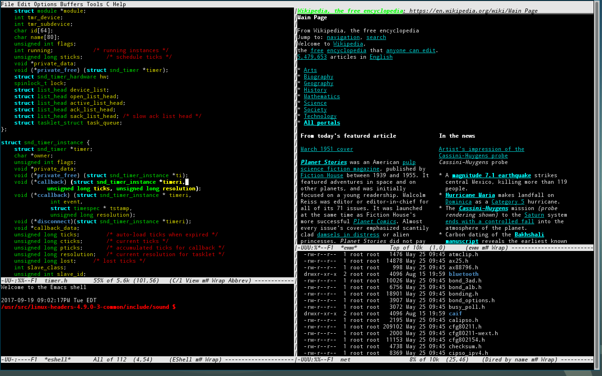

# Text editors

```
Brief (to be removed)

vim 😍
emacs
Intellij
Atom
Sublime (???)
gedit 💩
```

Choosing the right text editor can be a difficult choice, one which has been the source of many a flame war on the Internet. He're we'll run through some popular text editor choices, so you can pick what feels best for you.

## gedit

This is the bog-standard text editor that ships with Ubuntu. It works in almost exactly the way you would expect. There isn't too much to customise, and editing multiple files at the same time can be fairly slow. Any version control (e.g. with git) must be performed manually.

Workflow speed | Customisability | Version control integration | Learning Curve
--- | --- | --- | ---
4/10 | 3/10 | No | Easy


## Atom

This is a piece of software made by GitHub, advertised as being a "hackable text editor for the 21st century". There are many plugins which you can install to speed up your workflow, and editing multiple files is a little easier. Atom is incredibly customisable; you can control keyboard shortcuts, themes, plugins and even create a script to run when the app starts up. Version control with git is built in.

Workflow speed | Customisability | Version control integration | Learning Curve
--- | --- | --- | ---
6/10 | 8/10 | Yes | Easy


## Jetbrains IDEs

Jetbrains are a company that make a series of IDEs (integrated development environments) for various languages. Their flagship product, Intellij Idea, is the recommended IDE to use when programming in Java in 1st/2nd term of 1st year, however they also have products such as PyCharm for Python programming and CLion for C programming. These IDEs in general are less customisable than Atom, however you can still configure many different plugins (e.g. vim keyboard shortcuts), and all products come with version control integration. Students can get all of Jetbrains' products for free.

Workflow speed | Customisability | Version control integration | Learning Curve
--- | --- | --- | ---
6/10 | 5/10 | Yes | Medium


###### Displayed - Intellij Idea

## emacs

TODO - find someone who likes emacs enough to explain it here



## vim

vim is perhaps the hardest text editor to learn how to use, however the rewards that can be reaped in terms of speed are astounding. There are a huge number of built-in keyboard shortcuts, all of which can be remapped if you don't like them, and an almost uncountable number of plugins for vim are available online. Since vim is run using a command line interface it is very fast, however the downside is there are no fancy integrations with other services such as version control - everything else must be done manually.

Workflow speed | Customisability | Version control integration | Learning Curve
--- | --- | --- | ---
9/10 | 9/10 | No | Steep


