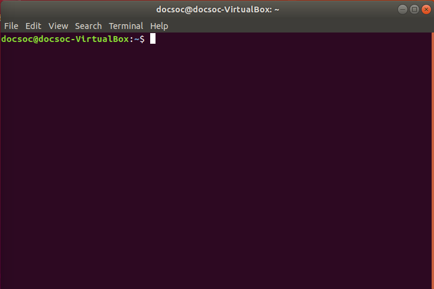
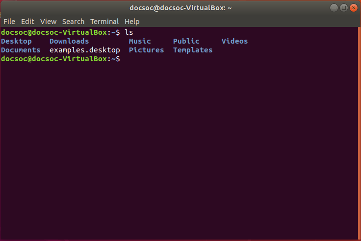
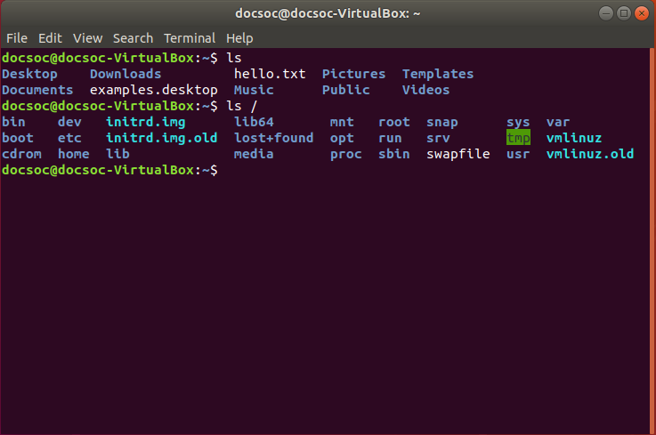
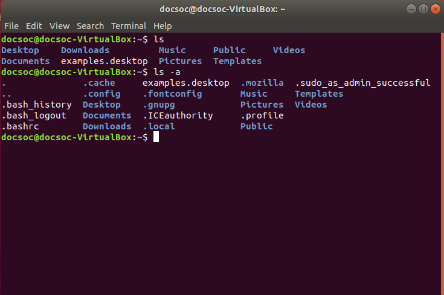
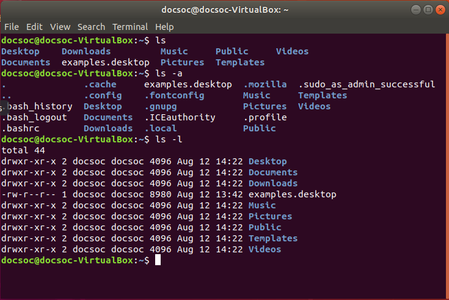
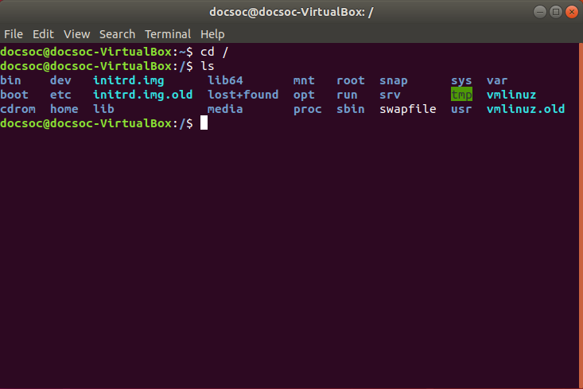

# An introduction to the command line

```
Brief (to be removed)

Open terminal
Ctrl+ and ctrl- to zoom in and out
Type ls
Teach ls (-a, -l)
Teach cd
TIP: THE UP AND DOWN BUTTONS CAN BE USED TO SELECT PREVIOUS COMMANDS
File directory structure (/ and ~ meaning)
Understanding file permissions
. means current directory
.. means parent directory
Relative vs absolute paths
Hidden files (start with .)
```
## Using the terminal

In your applications folder there's a program called 'Terminal'. The Linux terminal provides a **command line interface** between you and your computer, which is named as such since the only thing you're allowed to do is enter commands on-screen. The terminal comes with a huge list of preset commands, and you can install even more commands with **package managers** (see the Package Managers section). Almost all programming on Linux involves good knowledge of how to use the command line interface.

For now, we'll focus on some basic commands that allow you to interact with your computer. Start by opening the Terminal app; you will be greeted with a command line interface like so:


###### Don’t worry about the left hand side too much yet - this reads as your username ‘@’ the hostname of your computer

```
TIP: You can use Ctrl+ and Ctrl- to make the text bigger and smaller.
```

Before we begin, we'll have to explain some terms. Don't worry if these don't make sense at first, you'll pick up concepts quickly when experimenting with the `ls` and `cd` commands:
* Every command you execute in the terminal takes place from the perspective of a certain directory, called your **working directory**.

* Your **home directory** is the default location for all your personal files, and is located at `/home/<your-username>/`. Your home directory is the default working directory when you open the terminal for the first time.

* The **root directory** is the highest directory in the Linux hierarchy, and contains all other files and directories. It is denoted by `/`. Folders in the root directory cannot be modified without **root privileges** (see the `sudo` command for more details). NOTE: the root directory contains many important folders which should be kept as they are. Do not try and modify any of these folders unless you know what you're doing.

## The `ls` command

The first command is the easiest - it simply lists all the files and directories in your working directory! Type in `ls` (that’s lowercase ‘l’ followed by ‘s’) to see all the files in your home directory (since remember, each Terminal window opens into your home directory).



If we type `ls <directory>`, we can list all the files in that directory. As an example, type `ls /`. You should be able to see all the folders in the root directory!



We can add several flags to `ls` to change its output. Adding `-a` to the command will print all files and directories, __including any hidden files__, in the working directory. `.` and `..` are also printed, which refer to the working directory and its parent directory respectively.



Adding `-l` prints the list of files/directories in so-called long form. This prints information such as
* file permissions
* owner name
* owner’s group name
* file size (in bytes)
* date last modified

We explain how to read file permissions (e.g. `drwxr-xr-x`) later on in this section.



```
TIP: the up and down arrow keys can be used to scroll through previously used commands. This can save a lot of time when you eventually start using longer commands.
```

## The `cd` command

The `cd` command is used to change your current working directory. Type `cd <directory>` to switch to that directory.

For example, `cd /` changes our current working directory to the root directory. Now typing `ls` has the same effect as typing `ls /` from any other directory.



That's it! You've mastered two of the most important Linux terminal commands.

## File permissions

## Directory structure

Every Linux operating system, no matter which distro you use, will have the same underlying directory structure for storing files.

The root directory is referred to as `/` (a single slash sign). This is the uppermost directory in the file hirearchy, and all directories are sub-directories of this. Even mounted filesystems (e.g. the files on a USB stick plugged into your Linux computer) can be accessed from the root directory. The root directory contains many important folders which can only be modified with **root privileges** (see the description of the sudo command for more details). Don’t mess around with the root directory folders unless you know what you are doing.

Your home directory is `/home/<your-username>/`. This is where your user’s personal files are stored. Your home directory can also be accessed by typing `~/`.

In your Terminal prompt, the directory you are currently working in is called the **working directory**. Your home folder is the default working directory when you open Terminal for the first time. The working directory can be changed using the `cd` command (we will explain this command later).

Terminal has various shortcuts to refer to important directories: 
* A single dot (`.`) refers to the current working directory
* Double dots (`..`) refers to its parent directory

## Relative and absolute paths

A directory path can be specified in two different ways:

An **absolute path** is given with reference to the root directory, and always begins with a `/`. For example, `/usr/local/bin/` is an absolute path.

In contrast, a **relative path** is given with reference to the current working directory, and doesn’t begin with a `/`. For example, say we have a folder `A` in `/usr/bin/`, which contains the file `B.txt`.


###### Our example directory structure

Let’s run through some scenarios:

The absolute path to `B.txt` is `/usr/bin/A/B.txt`.

If our current working directory is `/`, then the relative path to `B.txt` would be `usr/bin/A/B.txt`.

If our current working directory is `/usr/`, then the relative path to `B.txt` would be `bin/A/B.txt`.

If our current working directory is `/usr/bin/`, then the relative path to `B.txt` would be `A/B.txt`.

If our current working directory is `/usr/bin/A/`, then the relative path to `B.txt` would simply be `B.txt`.

## Hidden files

Files or directories that begin with `.` (a single dot) are hidden, and by default aren’t viewable to an ordinary user. Most hidden files and folders across the  Linux filesystem are configuration files, e.g. the bash config file `.bashrc` and the `.git` folders inside git repositories. See the `ls` command for how to view hidden files.
