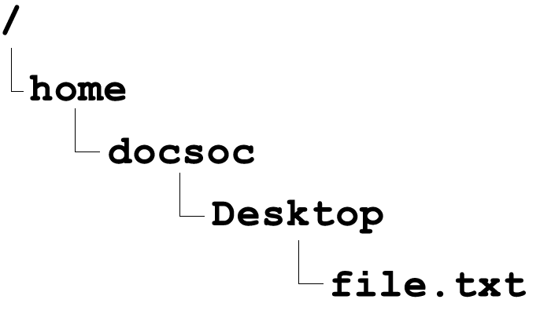

# An introduction to the command line

```
Brief (to be removed)

Open terminal
Ctrl+ and ctrl- to zoom in and out
Type ls
Teach ls (-a, -l)
Teach cd
TIP: THE UP AND DOWN BUTTONS CAN BE USED TO SELECT PREVIOUS COMMANDS
File directory structure (/ and ~ meaning)
. means current directory
.. means parent directory
Relative vs absolute paths
Hidden files (start with .)
```


## Directory structure

Every Linux operating system, no matter which distro you use, will have the same underlying directory structure for storing files.

The root directory is referred to as `/` (a single slash sign). This is the uppermost directory in the file hirearchy, and all directories are sub-directories of this. Even mounted filesystems (e.g. the files on a USB stick plugged into your Linux computer) can be accessed from the root directory. The root directory contains many important folders which can only be modified with **root privileges** (see the description of the sudo command for more details). Don’t mess around with the root directory folders unless you know what you are doing.

Your home directory is `/home/<your-username>/`. This is where your user’s personal files are stored. Your home directory can also be accessed by typing `~/`.

In your Terminal prompt, the directory you are currently working in is called the **working directory**. Your home folder is the default working directory when you open Terminal for the first time. The working directory can be changed using the `cd` command (we will explain this command later).

Terminal has various shortcuts to refer to important directories: 
* A single dot (`.`) refers to the current working directory
* Double dots (`..`) refers to its parent directory

## Relative and absolute paths

A directory path can be specified in two different ways:

An **absolute path** is given with reference to the root directory, and always begins with a `/`. For example, `/usr/local/bin/` is an absolute path.

In contrast, a **relative path** is given with reference to the current working directory, and doesn’t begin with a `/`. For example, say we have a folder `A` in `/usr/bin/`, which contains the file `B.txt`.


###### Our example directory structure

Let’s run through some scenarios:

The absolute path to `B.txt` is `/usr/bin/A/B.txt`.

If our current working directory is `/`, then the relative path to `B.txt` would be `usr/bin/A/B.txt`.

If our current working directory is `/usr/`, then the relative path to `B.txt` would be `bin/A/B.txt`.

If our current working directory is `/usr/bin/`, then the relative path to `B.txt` would be `A/B.txt`.

If our current working directory is `/usr/bin/A/`, then the relative path to `B.txt` would simply be `B.txt`.

## Hidden files

Files or directories that begin with `.` (a single dot) are hidden, and by default aren’t viewable to an ordinary user. Most hidden files and folders across the  Linux filesystem are configuration files, e.g. the bash config file `.bashrc` and the `.git` folders inside git repositories. See the `ls` command for how to view hidden files.
